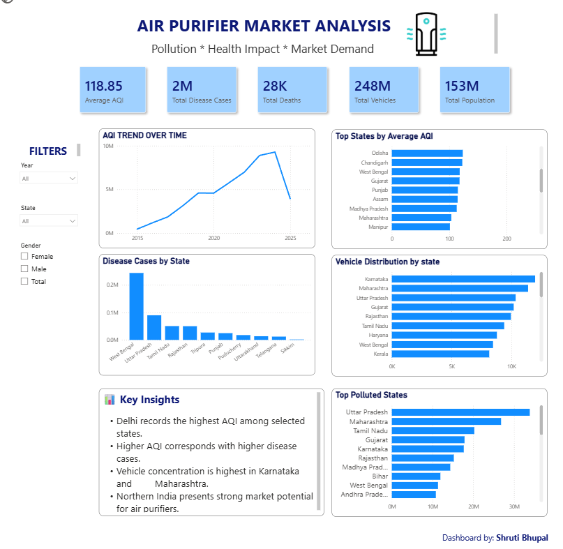

# 🌍 Air Purifier Market Analysis Dashboard

## 📌 Project Overview

This Power BI dashboard analyzes air quality, population, disease cases, mortality rates, and vehicle density across Indian states to identify high-potential markets for air purifier businesses. The dashboard helps understand environmental and public health trends for data-driven decision-making.

---

## 🎯 Business Problem

The objective of this project is to identify potential markets for air purifier products by analyzing:

- Air Quality Index (AQI)
- Disease cases
- Deaths
- Population
- Vehicle density
- State-wise environmental trends

---

## 🛠 Tools Used

- Power BI
- Microsoft Excel
- DAX
- Power Query

---

## 📊 Dashboard Preview



---

## 📈 Key Performance Indicators

- Average AQI
- Total Disease Cases
- Total Deaths
- Total Population
- Vehicle Density

---

## 📊 Dashboard Features

- AQI Trend Analysis
- State-wise AQI Comparison
- Disease Cases Analysis
- Vehicle Density Analysis
- Population Analysis
- Interactive Filters

---

## 💡 Key Insights

- States with higher AQI generally show a higher environmental health burden.
- Population and vehicle density contribute significantly to pollution levels.
- Several high-population states present strong market opportunities for air purifier products.
- The dashboard enables comparison across states for business planning.

---

## 📂 Repository Contents

```
Air_Purifier_Market_Analysis.pbix
dashboard.png
README.md
```

---

## 📚 Dataset

This project uses publicly available environmental and demographic datasets for educational and portfolio purposes.

---

## 👩‍💻 About Me

I'm an aspiring Data Analyst with skills in Power BI, SQL, Excel, and data visualization. I enjoy transforming raw data into meaningful insights and continuously learning new analytical techniques.
